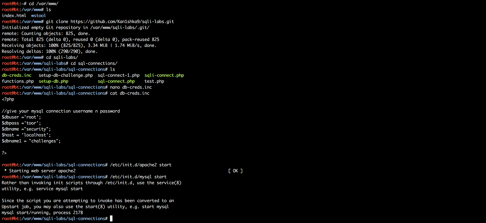
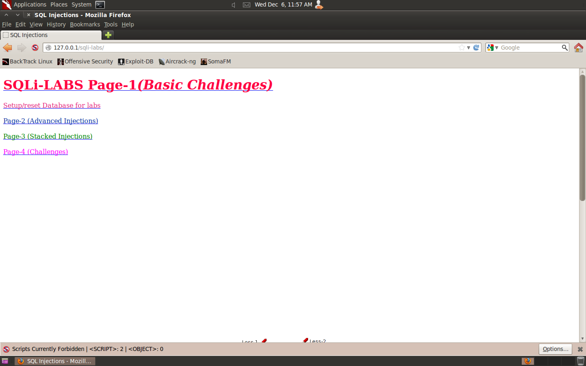
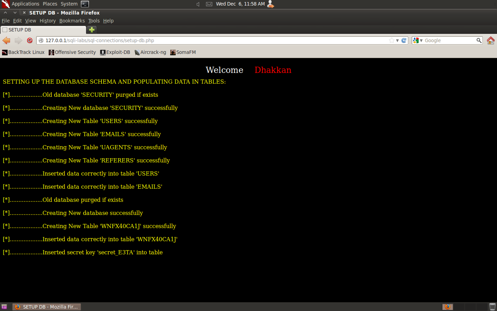

```sh
cd /var/www/
ls
git clone https://github.com/Kan1shka9/sqli-labs.git
cd sqli-labs/
cd sql-connections/
ls
nano db-creds.inc
```

```php
<?php

//give your mysql connection username n password
$dbuser ='root';
$dbpass ='toor';
$dbname ="security";
$host = 'localhost';
$dbname1 = "challenges";

?>
```

```sh
/etc/init.d/apache2 start
/etc/init.d/mysql start
```





